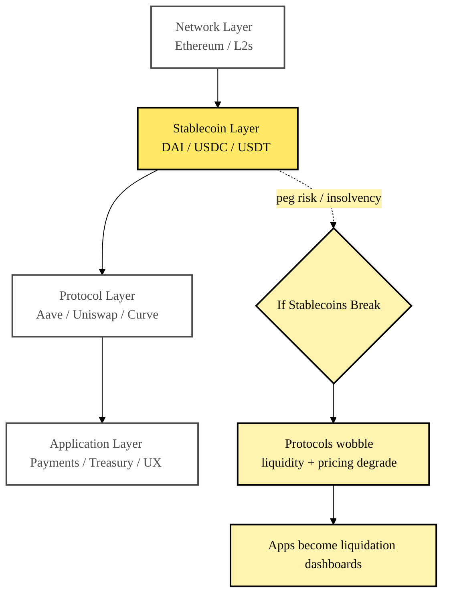

```mermaid
%%{init: {'theme':'base','themeVariables':{
  'fontFamily':'NEXT BOOK, ui-sans-serif, system-ui, -apple-system, Segoe UI, Roboto, Helvetica, Arial',
  'primaryColor':'#FFFFFF',
  'primaryTextColor':'#0B0B0B',
  'primaryBorderColor':'#000000',
  'lineColor':'#000000',
  'secondaryColor':'#FFF3B0',
  'tertiaryColor':'#FFE866'
}}}%%
flowchart TB
  n0["Network Layer<br/>Ethereum / L2s"]
  s0["Stablecoin Layer<br/>DAI / USDC / USDT"]
  p0["Protocol Layer<br/>Aave / Uniswap / Curve"]
  a0["Application Layer<br/>Payments / Treasury / UX"]

  n0 --> s0 --> p0 --> a0

  r0{"If Stablecoins Break"}
  r1["Protocols wobble<br/>liquidity + pricing degrade"]
  r2["Apps become liquidation dashboards"]

  s0 -. "peg risk / insolvency" .-> r0 --> r1 --> r2

  classDef base fill:#FFFFFF,stroke:#000000,stroke-width:2px,color:#0B0B0B;
  classDef muted fill:#FFFFFF,stroke:#4B4B4B,stroke-width:2px,color:#4B4B4B;
  classDef accent fill:#FFE866,stroke:#000000,stroke-width:2px,color:#0B0B0B;
  classDef risk fill:#FFF3B0,stroke:#000000,stroke-width:2px,color:#0B0B0B;

  class n0,p0,a0 muted;
  class s0 accent;
  class r0,r1,r2 risk;
```

