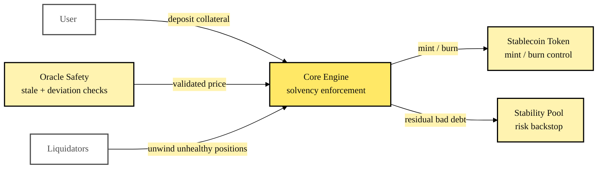

```mermaid
%%{init: {'theme':'base','themeVariables':{
  'fontFamily':'NEXT BOOK, ui-sans-serif, system-ui, -apple-system, Segoe UI, Roboto, Helvetica, Arial',
  'primaryColor':'#FFFFFF',
  'primaryTextColor':'#0B0B0B',
  'primaryBorderColor':'#000000',
  'lineColor':'#000000',
  'secondaryColor':'#FFF3B0',
  'tertiaryColor':'#FFE866'
}}}%%
flowchart LR
  user["User"]
  engine["Core Engine<br/>solvency enforcement"]
  dsc["Stablecoin Token<br/>mint / burn control"]
  oracle["Oracle Safety<br/>stale + deviation checks"]
  liq["Liquidators"]
  pool["Stability Pool<br/>risk backstop"]

  user -->|"deposit collateral"| engine
  engine -->|"mint / burn"| dsc
  oracle -->|"validated price"| engine
  liq -->|"unwind unhealthy positions"| engine
  engine -->|"residual bad debt"| pool

  classDef base fill:#FFFFFF,stroke:#000000,stroke-width:2px,color:#0B0B0B;
  classDef muted fill:#FFFFFF,stroke:#4B4B4B,stroke-width:2px,color:#4B4B4B;
  classDef accent fill:#FFE866,stroke:#000000,stroke-width:2px,color:#0B0B0B;
  classDef soft fill:#FFF3B0,stroke:#000000,stroke-width:2px,color:#0B0B0B;

  class engine accent;
  class dsc,oracle,pool soft;
  class user,liq muted;
```

